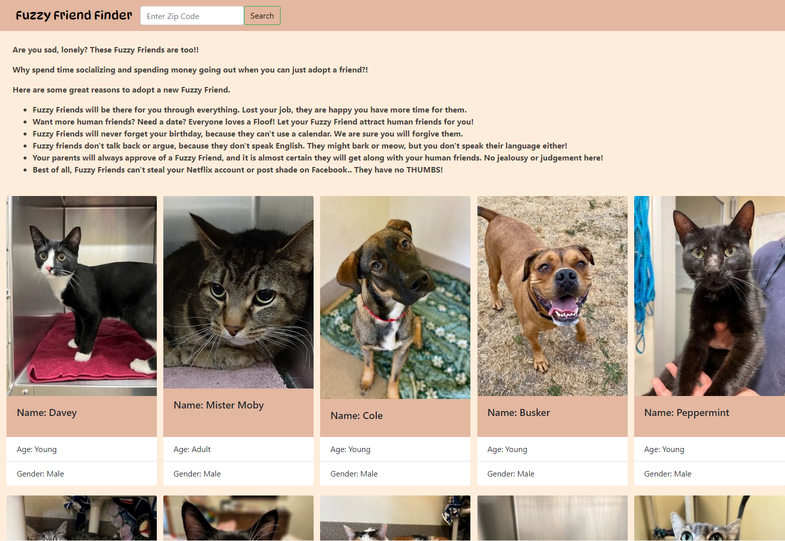

# project-1: Fuzzy-Friend-Finder

## Our Task

Create a simple application that allows a user to access local pet adoption services, and directs the user to pets that are currently available for adoption. This applicaton will run in the browser and feature dynamically updated HTML and CSS powered by jQuery and bootstrap.

This application will use the (https://api.petfinder.com/v2) and (https://i0.wp.com) libraries to provide updated adoption information.

## User Story

```
AS an average Joe with a void in my life
I WANT to fill that void with a fuzzy friend
SO THAT I can experience a more fulfilling day to day existence
```

## Acceptance Criteria

```
GIVEN I am using the application to find a fuzzy friend
WHEN I open the application
THEN the web page is displayed in the browser
WHEN I click the nav bar
THEN I am presented with a Search Form to submit my zipcode to access local pet adoption services
WHEN I enter my zipcode
THEN the webpage is updated to display pet information from the local pet adoption service
WHEN I click "favorite" on a pet
THEN the favorite button remains highlighted
WHEN I click "My Favorite Pets"
THEN I am presented with a list of pets I have favorited and their shelter's phone number
WHEN I scroll down
THEN I am presented with a carousel of pictures of "Recently Adopted Pets"
```

## Usage

Once you've opened the webpage, you can enter your zipcode into the Search feature. As soon as you press the Search button, you'll see information cards for several pets that are currently available for adoption in your area. The information card will tell you a little bit about each pet, including their name and a photo.

Link to our github repository:
https://github.com/csundheimjr/fuzzy-friend-finder

Deployed Link:
https://csundheimjr.github.io/fuzzy-friend-finder/

Google Slides:
https://docs.google.com/presentation/d/1GX6zYQuyrCXD6ZjoKL8v0togljlUwTLM9G-exCNv3dA/edit?usp=sharing

## Credits

Kaelin Salazar github.com/kaelinpsalazar kaelinsalazar@gmail.com
Michaela Varberg github.com/michaelavarberg michaelavarberg@gmail.com
Carl Sundheim Jr. github.com/csundheimjr csundheim@gmail.com
Jordan Laczkowski github.com/jordanlaczkowski jordan.laczkowski23@gmail.com
Christopher Boyle github.com/timberhead timberhead1121@gmail.com

    ```md
    
    ```
